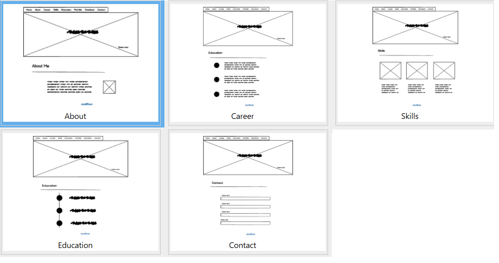

# Milestone Project 1 
##Resume Webpage##
 
https://github.com/lilychuang78/milestone1

**The Aim:**
This project is to build a personal protfolio website for potential recruiters.
The website includes a navigation of home page, work experiences, skills, contact form, project (links), and download (cv link). 
 
**Development Tools:** 
Github 
Gitpod 
Balsamiq Wireframes 
HTML5 
CSS3 
Bootstrap 
Bootsnip 
Google Chrome developer tools 
Freeformater.com 
Coolors 
Unsplash 
 
**Future Functionality:** 
At the moment, contact form is not used as it is not connected to the backend dataset.
Project should be linked to the protfolios (further milestone projects) in the future.
 
 
**User Design Experience:** 
>**Scope Plane:** 
	1. what they say they need:  a resume website, social media profile 
	2. what they actually need:  a responsive website with different devices, links to social media profile 
	3. what they don't know they need:  links to the future protfolio/projects, a CV that can be downloaded  
>**Skeleton Plane:** 
    
     
>**Strategy Plan:** 
	1. what does the user expect? information of working experience, education, and importantly skills 
	2. who are the users? potential recruiters or clients 
	3. does it offer what users want? content of web-design and programming itself, with future portfolios and contact information  
>**Structure Plane:** 
	The homepage leads to 'Career', 'Skills', 'Education', and 'Contact' pages and 'Download' and 'Portfolio' opens a bank window. 
	The navigation bar is always presented on the top of the screen so the users is able to navigate to other webpages. 
	(Future development: contact form connecting to backend)
